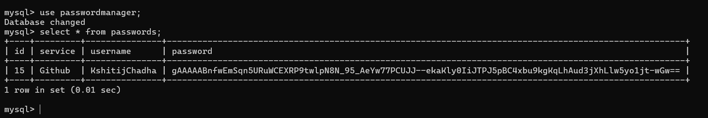

# Password Manager

A simple password manager built using Python, Tkinter for the GUI, and MySQL for storing encrypted passwords.

## Features

- **Add a password**: Save encrypted passwords to a MySQL database.
- **Retrieve a password**: Decrypt and view stored passwords.
- **Delete a password**: Remove a password entry from the database.
- **Password Generator**: Generate random secure passwords.
- **Password Strength Checker**: Evaluate the strength of generated passwords.

## Installation

1. Clone this repository:
    ```bash
    git clone https://github.com/kshitijchadha/Password-Manager.git
    cd Password-Manager
    ```

2. Create a `.env` file in the project directory with the following content (replace with your own credentials):
    ```plaintext
    DB_PASSWORD=your_mysql_password
    MASTER_PASSWORD=your_master_password
    ```

3. Create the MySQL database and table:
    ```sql
    CREATE DATABASE passwordmanager;
    USE passwordmanager;
    CREATE TABLE passwords (
        id INT AUTO_INCREMENT PRIMARY KEY,
        service VARCHAR(255) NOT NULL,
        username VARCHAR(255) NOT NULL,
        password BLOB NOT NULL
    );
    ```

4. Install required Python packages:
    ```bash
    pip install -r requirements.txt
    ```

5. Run the application:
    ```bash
    python app.py
    ```

## Usage

- **Add a password**: Enter the service name, username, and password, then click "Add Password".
- **Retrieve a password**: Enter the service name and master password to retrieve the stored password.
- **Delete a password**: Enter the service name and click "Delete Password".
- **Generate a password**: Use the password generator to create a random password and customize it based on length and character types.

## Security

- The application uses encryption to securely store passwords in the database.
- The master password is used to decrypt the stored passwords.


## Application Screenshots

### Main Screen
- After running the Python file `password_manager_gui.py`, we see the main screen with options to generate and manage passwords.


### Password Generation Options
- These are the random password generation options. We can choose the password length (4-32 characters), and we can include uppercase, digits, and special characters.


### Generate Password
- After filling out the Service and Username fields, click "Generate Password" to let the program generate a secure password, or enter a custom one.
- We can also see the strength of the generated password at the bottom.


### Hide Show Password
- By selecting the "Show Password" option, the generated password will be displayed for the user to see.


### Screenshot 5
- Clicking the "Add Password" button adds the password to the MySQL database, and a pop-up will confirm the successful addition of the password and its details.


### Added Details on SQL
- The user details in the MySQL database update in real-time after adding a new password.



### Password Added is Encrypted
- The password added to the database is encrypted, ensuring security and confidentiality.


### Password Retrieval with Invalid Master Password
- When attempting to retrieve a password, we need to enter the master password to verify the request. If the master password is incorrect, a pop-up will notify the user.


### Password Retrieval with Valid Master Password
- If the master password is correct, the pop-up will show the corresponding service, username, and password.


### Delete Password
- To delete a password, select the service and hit the "Delete Password" button. A pop-up will confirm that the password was deleted successfully.


### Deleted Password in MySQL Database
- The password is immediately deleted from the MySQL database in real-time.


